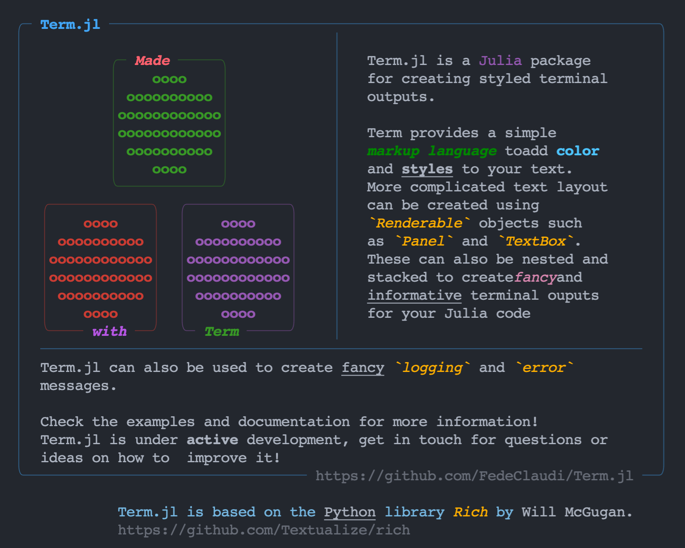

[](https://github.com/FedeClaudi/Term.jl/actions/workflows/CI.yml)
[](https://codecov.io/gh/FedeClaudi/Term.jl)
[](https://fedeclaudi.github.io/Term.jl/dev/)





# Term

## Documentation & installation

🖥️  [Documentation](https://fedeclaudi.github.io/Term.jl/dev/) 


Install with:
```
julia> ]  # enters the pkg interface
pkg> add Term
```