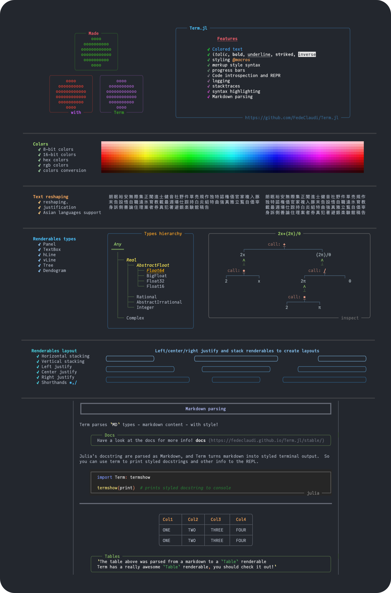

[](https://github.com/FedeClaudi/Term.jl/actions/workflows/CI.yml)
[](https://codecov.io/gh/FedeClaudi/Term.jl)
[](https://fedeclaudi.github.io/Term.jl/dev/)
[](https://juliahub.com/ui/Packages/Term/Ctj9q?t=2)
[](https://pkgs.genieframework.com?packages=Term)



(To see how the content in the image above was created, check: README.jl)
# Term

## Documentation & installation

🖥️  [Documentation](https://fedeclaudi.github.io/Term.jl) 


Install with:
```
julia> ]  # enters the pkg interface
pkg> add Term
```


### Supporting Term
If you like my work on Term so far and want to show support and help with Term's future development, please consider showing your support!

[](https://ko-fi.com/C0C5E36Z2)
