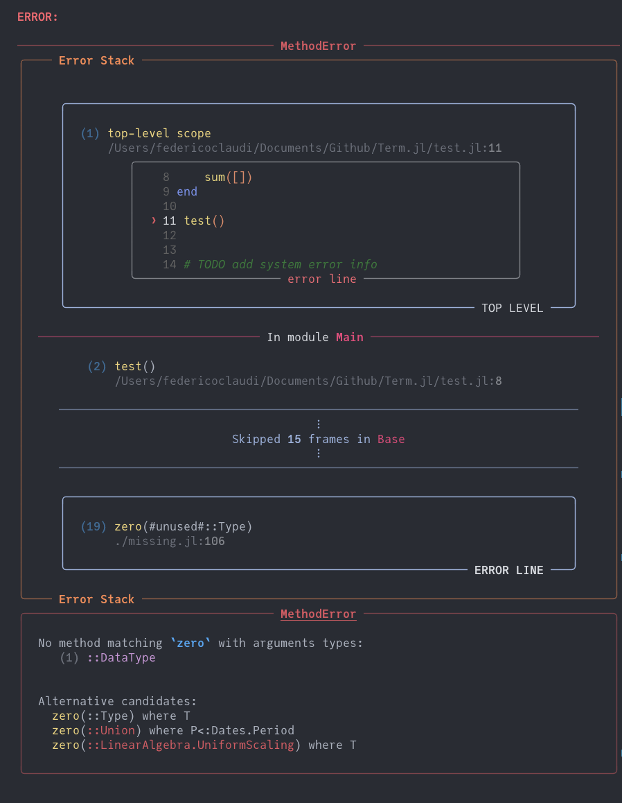

# Errors

In `Logging` we've seen how `Term` can replace the default logging system in Julia to produce stylized logging messages. `Term` can do the same for error messages and stack traces.


!!! danger "Danger zone"
    The way the `error` functionality is currently handled in `Term` entails re-defining methods from `Base`, Julia's own code. This is undesirable. It works, but it may lead to problems for some users or some unexpected behaviors, especially if other functions expected the re-defined code to work differently from how it works in `Term`. While this is fine if you're just writing code for your own comsumption, we **strongly discourage** using `Term`'s error functionality in production level code - code that needs to be turned into something that many people will use. We can't guarantee that this wouldn't results in a bunch of headaches. 
    With this warning in place, we do home that in the future Julia will provide hooks for error handling systems as it does for logging. In the meanwhile, you can enjoy `Term`'s stack traces privately in your code.


Setting up `Term` to handle errors for you is very simple:
```Julia
import Term: install_stacktrace

install_stacktrace()  # entering the danger zone

1 + "this wont work"
```



