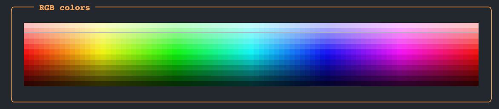

# Colors
Okay, so far so good. We can use macros like `@red` and the `tprint` function to print colored strings. But so far we've only been using few named colors, but..

```@example
function rainbow_maker() # hide
    text = "there's a whole rainbow\n of colors out there" # hide
    _n = Int(length(text)/2)  # hide
    R = hcat(range(30, 255, length=_n), range(255, 60, length=_n))  # hide
    G =hcat(range(255, 60, length=_n), range(60, 120, length=_n))  # hide
    B = range(50, 255, length=length(text))  # hide
    out = ""  # hide
    for n in 1:length(text)  # hide
        r, g, b = R[n], G[n], B[n]  # hide
        out *= "[($r, $g, $b)]$(text[n])[/($r, $g, $b)]"  # hide
    end # hide
    return out  # hide
end # hide
import Term: tprint  # hide
tprint(rainbow_maker()) # hide
```

so how can we use different kinds of colors?
It's all done through `Term`'s markup syntax of course. Look:
```@example
using Term: tprint # hide
tprint("[(255, 50, 100)]colors![/(255, 50, 100)]")
```

yep, you can pass a set of `(r, g, b)` values and that'll do it. Personally, I prefer working with hex codes, and so `Term` can accept them too:
```@example
using Term: tprint # hide
indigo = "#42A5F5"

tprint("Some [$indigo]color![/$indigo]")
```

## Under the hood
What `Term` is doing here is taking each bit of style information in the markup tag (each word or each `(...)` within `[...]`) and constructing style codes with an `ANSICode` object.

If the style informaton represents a color, `Term` first represents it as a `AbstractColor` type: `NamedColor` or `BitColor` or `RGBColor`.  

`NamedColor` objects represent simple colors like `red` and `blue`, `BitColor` represent 16-bit colors like `dark_goldenrod` and `RGBColor`, surprisingly, represents rgb-style colors. There's no method to represent hex colors as these are converted into rgb first. 

The distinction between `NamedColor`, `BitColor` and `RGBColor` is necessary because the three color styles are represented by a different syntax in the ANSI codes. Naturally, `Term` users won't normally worry about this and can use whichever color formulation is most convenient.


## Colors
Below all named colors, 16bit colors and (many) RGB colors are printed for display.

```@example
import Term: CODES_16BIT_COLORS
import Term: Panel
import Term.color: hsl2rgb

function make_named_colors()
    sort_idx = sortperm(collect(values(CODES_16BIT_COLORS)))
    cnames = collect(keys(CODES_16BIT_COLORS))[sort_idx][1:9]
    colors = ""
    colors = join(map(
        (c)->"[on_$c] [/on_$c]", cnames
    ))
    return colors
end


function make_16bit_colors()
    sort_idx = sortperm(collect(values(CODES_16BIT_COLORS)))
    cnames = collect(keys(CODES_16BIT_COLORS))[sort_idx][9:end]
    colors = ""
    colors = join(map(
        (c)->c[1] %  20 == 0 ? "[on_$(c[2])] [/on_$(c[2])]\n" : "[on_$(c[2])] [/on_$(c[2])]", enumerate(cnames)
    ))
    return colors
end

function make_rgb_colors(; max_width=88)
    colors = ""

    for y in 0:5
        for x in 0:max_width
            h = x / max_width
            l = 0.1 + (((5-y) / 5) * 0.7)
            color = hsl2rgb(h*360, .9, l)
            bg = hsl2rgb(h*360, .9, l + 0.7/10)

            colors *= "[$color on_$bg]▄[/$color on_$bg]"
        end
        colors *= "\n"
    end

    return colors
end


print(
    Panel(make_named_colors(), width=20, justify=:center, title="Named", style="bold yellow", padding=(2, 2, 1, 0)) / # stacking operator, see layout page
    Panel(make_16bit_colors(), width=42, fit=true, title="16 bit colors", style="bold yellow", padding=(2, 2, 1, 0)) /
    Panel(make_rgb_colors(), width=88, title="RGB colors", style="bold yellow", fit=true, padding=(2, 2, 1, 0))
)
```


Oooops, it seems that we broke Documenter's layout again. This is what it looks like if you run this code in your terminal:

